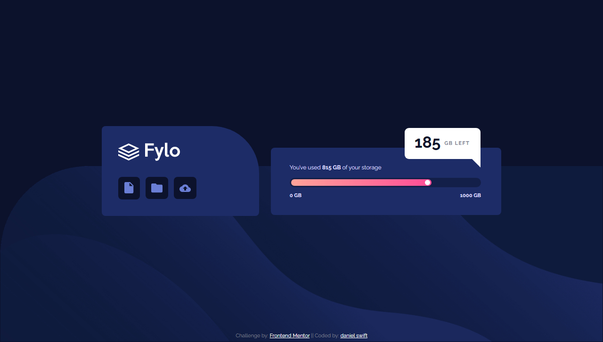

# Frontend Mentor - Fylo data storage component solution

This is a solution to the [Fylo data storage component challenge on Frontend Mentor](https://www.frontendmentor.io/challenges/fylo-data-storage-component-1dZPRbV5n). Frontend Mentor challenges help you improve your coding skills by building realistic projects. 

## Table of contents

- [Overview](#overview)
  - [The challenge](#the-challenge)
  - [Screenshot](#screenshot)
  - [Links](#links)
- [My process](#my-process)
  - [Built with](#built-with)
  - [What I learned](#what-i-learned)
  - [Useful resources](#useful-resources)
- [Author](#author)
- [Acknowledgments](#acknowledgments)

## Overview

### The challenge

Users should be able to:

- View the optimal layout for the site depending on their device's screen size

### Screenshot

### Links

- Solution URL: [Add solution URL here](https://your-solution-url.com)
- Live Site URL: [Swift Fylo Data Storage Component](https://swift-fylo-data-storage-component.netlify.app)

## My process

### Built with

- Semantic HTML5 markup
- CSS custom properties
- Flexbox
- Mobile-first workflow

### What I learned

I learnt how to make a progress bar using CSS and how to make a callout shape

### Useful resources
[Frontend Mentor] - (https://www.frontendmentor.io/) - Improve your Front-End skills my building projects

## Author

- Website - [danielswift10](https://github.com/danielswift10)
- Frontend Mentor - [@danielswift10](https://www.frontendmentor.io/profile/danielswift10)
- Twitter - [@swift_fingers_](https://twitter.com/swift_fingers_)

## Acknowledgments
Special Thanks goes to my creator, God the Almighty!